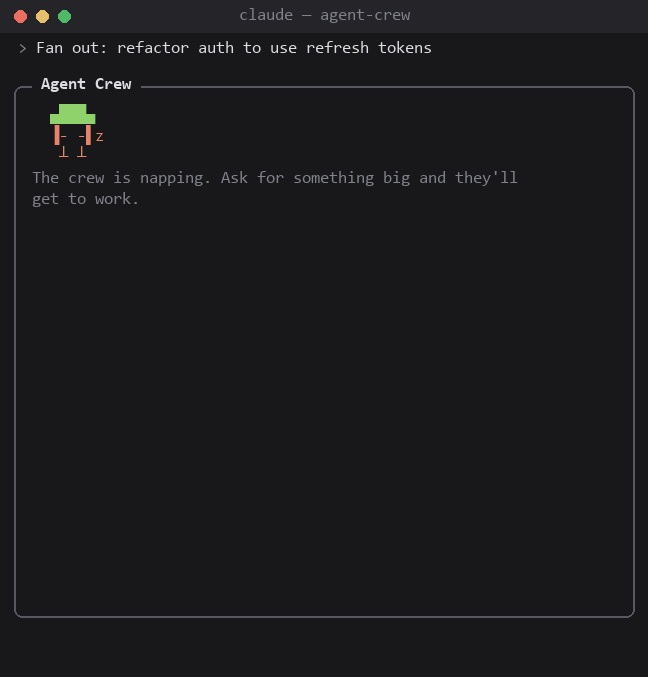

# oh-my-claude-mods

Mods for [Claude Code](https://claude.com/claude-code). Each one is a standalone plugin under `plugins/`.

| Plugin | What it does |
| --- | --- |
| [agent-crew](plugins/agent-crew) | A live pane of your subagents as a little pixel crew: who is working, on what, and how far along. |



## Install

In Claude Code:

```
/plugin marketplace add xinhuagu/oh-my-claude-mods
/plugin install agent-crew@oh-my-claude-mods
```

Restart the session afterwards.

## Development

```
npm install
npm run check   # validate + typecheck + test
```

`npm test` runs the plugin's `tests/*.test.tsx` with `claude plugin test`. `npm run typecheck` needs the types Claude Code writes into `plugins/agent-crew/.claude-plugin/types/` once it has loaded the plugin (for example with `claude --plugin-dir plugins/agent-crew`).

## License

MIT
